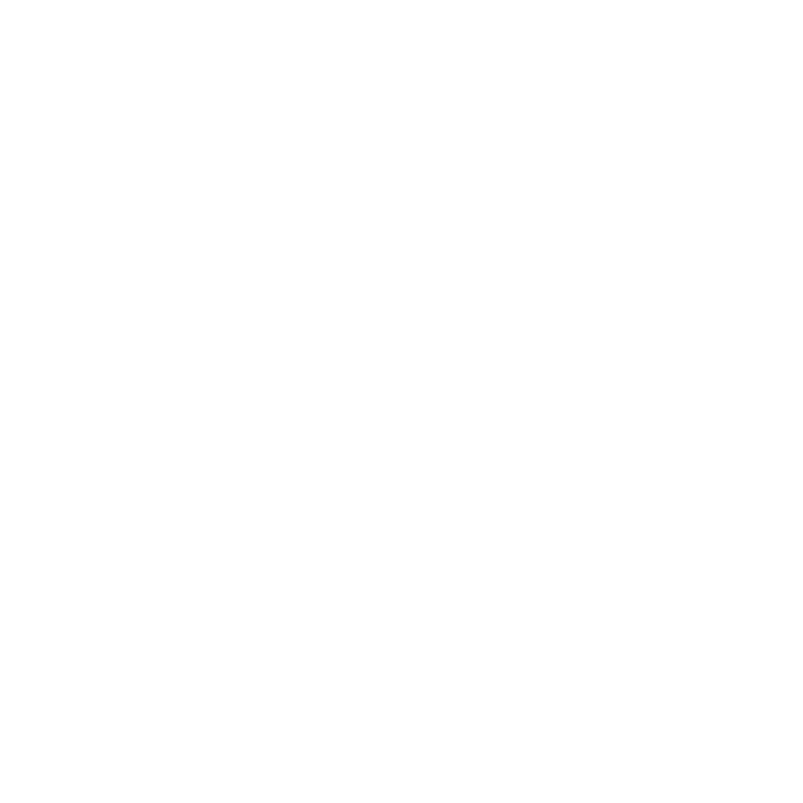
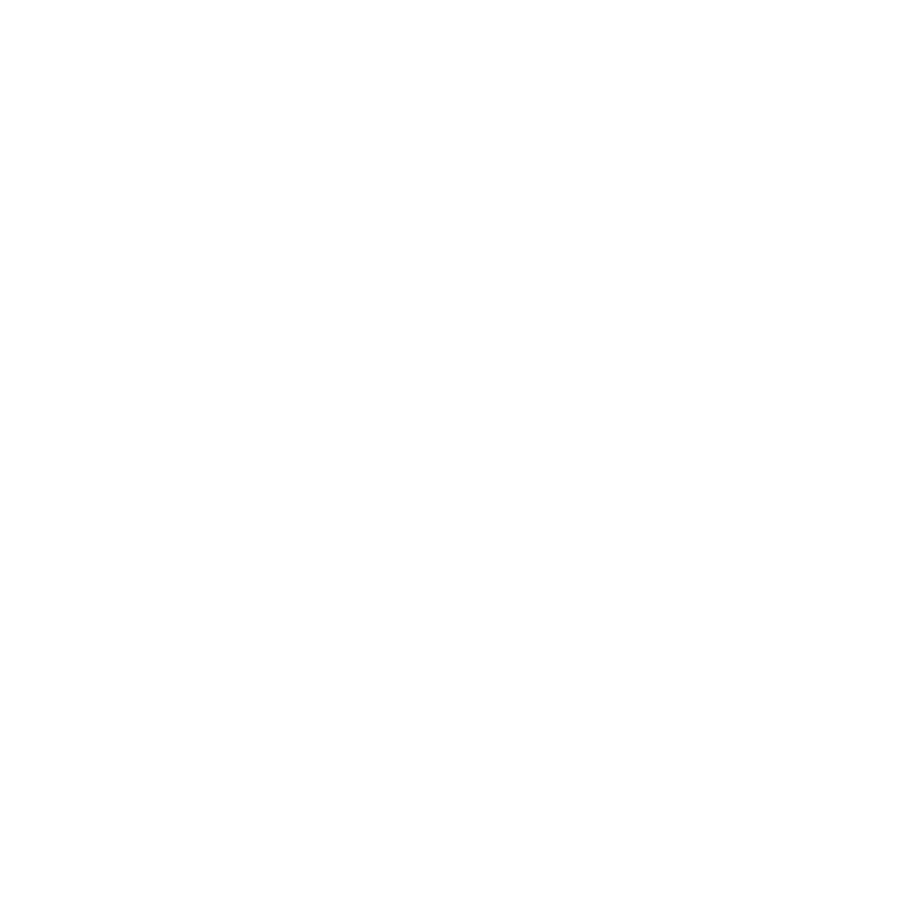

# 🤾🏼‍♂️ Thibault Cheneviere

I'm Thibault Cheneviere, a student in IT at TELECOM Nancy. I'm interested in all technologies especially cli development in C or Rust. I'm also interested in cybersecurity. I participate in some CTF such as GreHack or TRACS and I also practice on [root-me](https://www.root-me.org/Thib-681376?lang=fr&var_mode=calcul).

---

## 🧰 Languages and Tools

          

---

---

 

<!--
**thibault-cne/thibault-cne** is a ✨ _special_ ✨ repository because its `README.md` (this file) appears on your GitHub profile.

Here are some ideas to get you started:

- 🔭 I’m currently working on ...
- 🌱 I’m currently learning ...
- 👯 I’m looking to collaborate on ...
- 🤔 I’m looking for help with ...
- 💬 Ask me about ...
- 📫 How to reach me: ...
- 😄 Pronouns: ...
- ⚡ Fun fact: ...
-->
